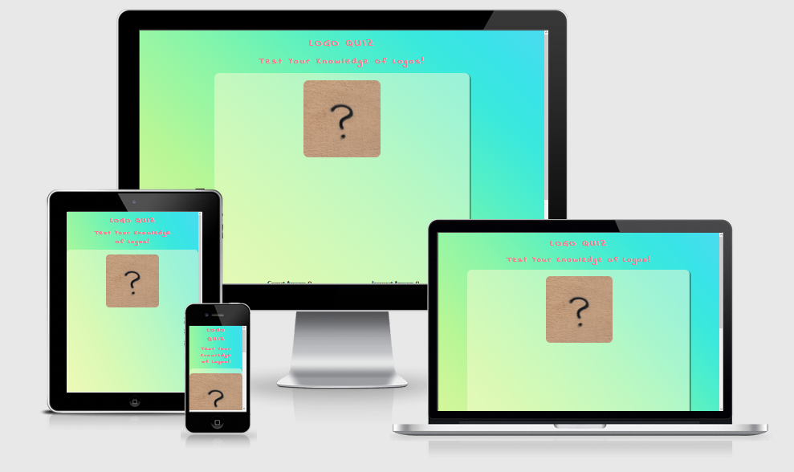
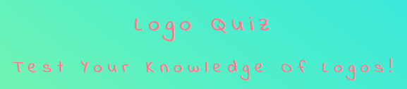
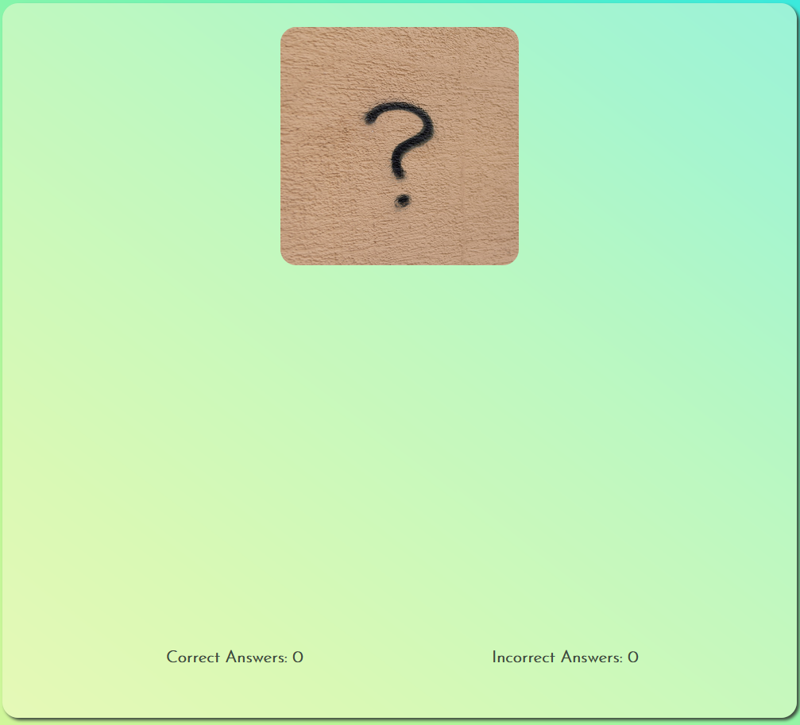
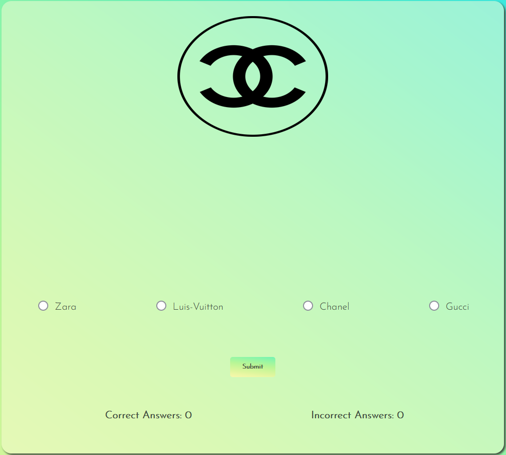
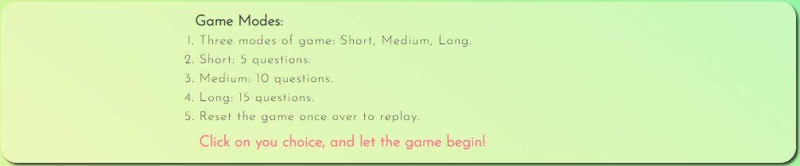
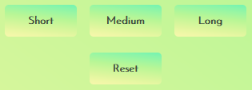
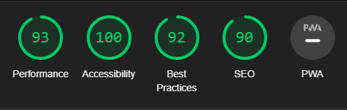

# LOGO QUIZ

[View The Live Project Here](https://farrukh-ahm.github.io/Logo-Quiz/)

The Logo Quiz is for people who would like to test their knowledge of logos, with questions ranging from popular food chain to soccer teams and tech companies. The questions are picked up randomly by the system and 4 options given to choose from, eliminating the frustration of any spelling mistake due to manual input or the itch of knowing the logo but not being able to come up with the brand it’s associated with.

The website is targeted towards any group of individuals interested in logos. 

## Features:

   ### UI/UX:

   - #### Colour Scheme
      1. The gradient background is based on three basic colors, LemonChiffon, PaleGreen and LightSkyBlue.
      2. The h1, h2 and h3 elements use LightPink color whereas the body fonts are HunterGreen.

   - #### Typography
      1.  The Josefin Sans font is the main font used throughout the whole website with Sans Serif as the fallback font in case for any reason the font isn't being imported into the site correctly. The website header uses Indie Flower font with Cursive as backup.
      2. The Indie Flower font gives the heading a very palyful and fun appearance.
      3. The body font of Josefin Sans is easy to read and is easy on eyes, while providing a nice gaming experience. 
   
   ### Existing Features:

   1. #### Header
    
       -   Displayed at the top of the webpage. Fonts and colours used for this are both payful and attractive to give off an ambience of fun and excitement.
       -   The colour sits perfectly against the body's gradient background and clearly mentions the game the user can engage with.

         
        
         

   2. #### Game Area
    
       - The Game-Area section displays the logos of the various brands and options the user can select from. This area displays the game score too.
       - When the page loads or the game resets, the user can only see the default image with score card at the bottom of the section.
       - Once the user has chosen their desired game mode, the game area displays randomly selected brand's logo and 4 options associated with it.
       - The user can select any one of the 4 options and click on the submit button.
       - Once submitted, a message is displayed letting the user know whether their answer was correct or not. Score is added accordingly.
       - Once the game is over, another message displays telling the user that the game is over and displays the final score.
       - The user can then reset the game manually and replay their desired game mode.

         
        
         
         
        
         

   3. #### Game Mode Card

        - The Game Mode card clearly shows the available game modes which a user can select and play.
        - There are 3 modes, as mentioned in the card, Short, Medium and Long.
        - The mode determines the number of questions that will be presented to the user and is mentioned in this section.

         
        
         

   4. #### Buttons for Game Modes and Game Reset

        - The Game Mode selection buttons are available just below the Game Mode instruction card.
        - The user can conveniently select any game mode they want to play according to their liking.
        - If the user wants to reset the game at any time, they can easily do so by clicking on the Reset button and they can got again by choosing a game mode.
         
        &emsp;&emsp;&emsp;&emsp;&emsp;&emsp;&emsp;&emsp;&emsp;&emsp;&emsp;&emsp;  
         
    
   ### Features Left To Implement:
- Would like to add function to check that a question is not being repeated during one cycle of the chosen game mode. Would need a bit more time to work on this as it would be little more complicated. 

## Technologies Used

### Languages Used

-   [HTML5](https://en.wikipedia.org/wiki/HTML5)
-   [CSS3](https://en.wikipedia.org/wiki/Cascading_Style_Sheets)
-   [JavaScript](https://en.wikipedia.org/wiki/JavaScript)

### Frameworks, Libraries & Programs Used

1. [Google Fonts:](https://fonts.google.com/)
    - Google fonts were used to import the 'Josefin Sans' and 'Indie Flower' font into the style.css file which is used on the website.
2. [ColorSpace:](https://mycolor.space/)
    - The body gradient and the font colors were picked from ColorSpace website, which also provided all the colors used in gradient.
3. [Git](https://git-scm.com/)
    - Git was used for version control by utilizing the Gitpod terminal to commit to Git and Push to GitHub.
4. [GitHub:](https://github.com/)
    - GitHub is used to store the project's code after being pushed from Git.
5. [Balsamiq:](https://balsamiq.com/)
    - Balsamiq was used to create the wireframes during the design process.

## Testing
The website has been tested on different devices and screen sizes, eg. a 21.5inch monitor, 15inch laptop screen, iPad, iPhone and Android devices. The website runs smoothly and generates appropriate results without any issues. The hover effect on the buttons work perfectly on the computer, the messages are dispalyed proeprly and the scores are added as intended. The images of the brand logos displays nicely on all devices without any issue.

The W3C Markup Validator and W3C CSS Validator Services were used to validate every page of the project to ensure there were no syntax errors in the project.

-   [W3C Markup Validator](https://validator.w3.org/#validate_by_input) - [Results](https://validator.w3.org/nu/?doc=https%3A%2F%2Ffarrukh-ahm.github.io%2FLogo-Quiz%2F)
-   [W3C CSS Validator](https://jigsaw.w3.org/css-validator/#validate_by_input) - [Results](https://jigsaw.w3.org/css-validator/validator?uri=https%3A%2F%2Ffarrukh-ahm.github.io%2FLogo-Quiz%2F&profile=css3svg&usermedium=all&warning=1&vextwarning=&lang=en)
-   [JS Hint](https://jshint.com/)

The website was also tested through Lighthouse on Chrome for its Accessibility Score. 

## Bugs
There were some issues with the diplay of the images at first, which got sorted by working on the image sizes. Also, there was an issue with the display of the result at the end, which was solved by using the setTimeout() method in the JavaScript.

## Deployment
The project was deployed to GitHub Pages using the following steps...

1. Log in to GitHub and locate the [GitHub Repository](https://github.com/farrukh-ahm/logo-quiz.git)
2. At the top of the Repository (not the top of the page), locate the "Settings" Button on the menu.
3. On the Settings page, locate the "Pages" link on the left side, under the "Code and Automation" category. 
4. Under "Source", click the dropdown called "None" and select "Master Branch" or "Main".
5. The page will automatically refresh.
6. the new published website's address [link](https://farrukh-ahm.github.io/logo-quiz/) will be displayed at the top of the "GitHub Pages" section.

## Credits

* ### Media

    - All the images used on the website are free-to-use provided by [Unsplash](https://unsplash.com/) and [1000Logos](https://1000logos.net/).
    - The default image used on the website is hosted by Marcel Strauß on [Unsplash](https://unsplash.com/)
    - The gradient was selected from [ColorSpace](https://mycolor.space/gradient3) website.

* ### Code

The solution for setting a time delay before next question is displayed and before the reset happens was used from an article by James Hibbard published on [SitePoint](https://www.sitepoint.com/delay-sleep-pause-wait/) 

## Acknowledgements

- My mentor for continuous help and valuable feedback.
- Tutor support at Code Institute for their support.
